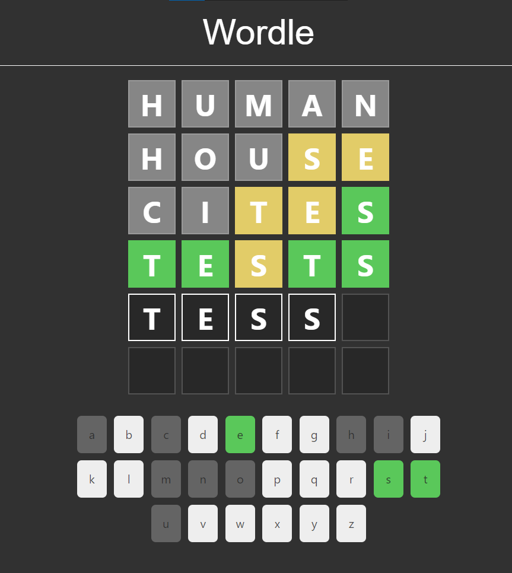
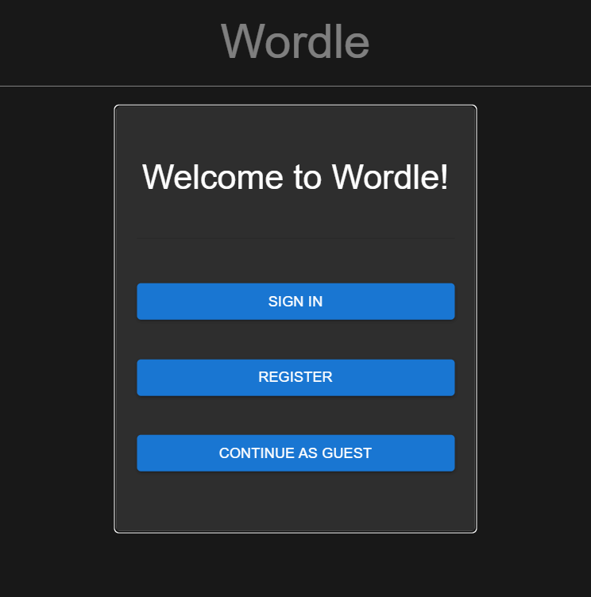
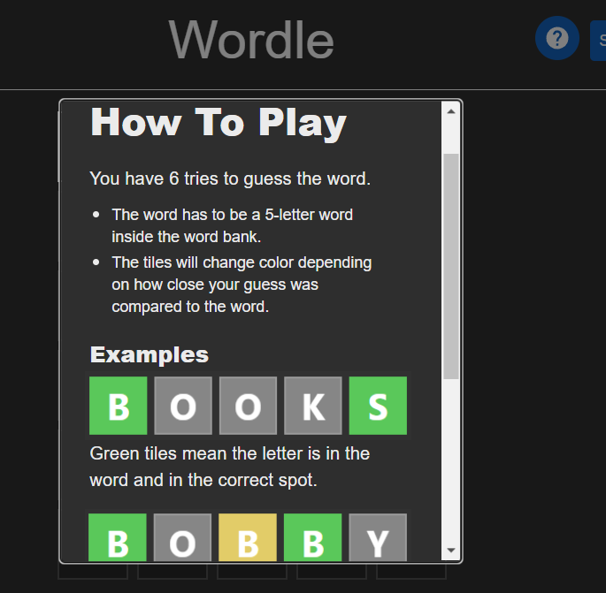
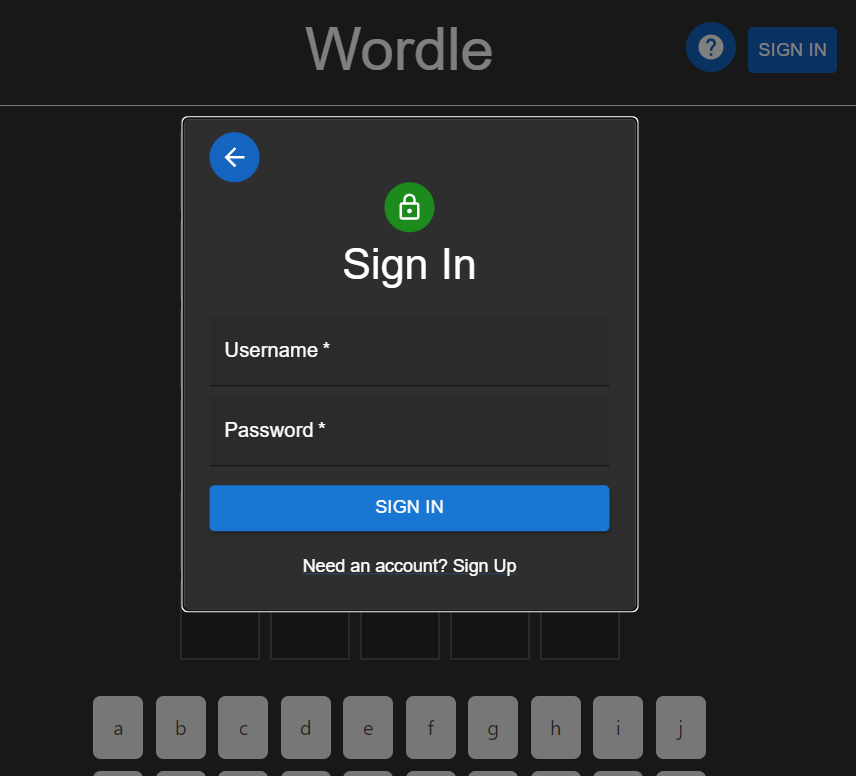
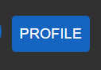
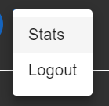
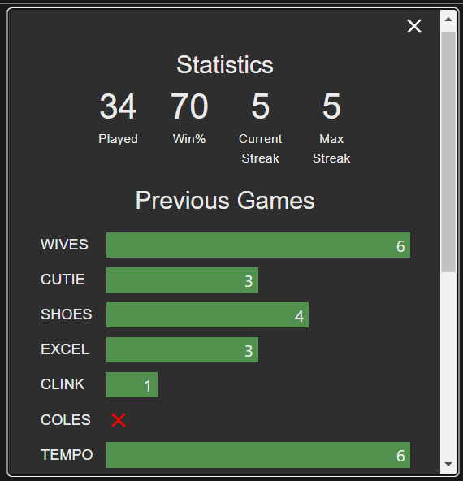

<!-- Improved compatibility of back to top link: See: https://github.com/othneildrew/Best-README-Template/pull/73 -->

<!--
*** Thanks for checking out the Best-README-Template. If you have a suggestion
*** that would make this better, please fork the repo and create a pull request
*** or simply open an issue with the tag "enhancement".
*** Don't forget to give the project a star!
*** Thanks again! Now go create something AMAZING! :D
-->

<!-- PROJECT SHIELDS -->
<!--
*** I'm using markdown "reference style" links for readability.
*** Reference links are enclosed in brackets [ ] instead of parentheses ( ).
*** See the bottom of this document for the declaration of the reference variables
*** for contributors-url, forks-url, etc. This is an optional, concise syntax you may use.
*** https://www.markdownguide.org/basic-syntax/#reference-style-links
-->

<!-- PROJECT LOGO -->
<h3 align="center">Wordle</h3>

  

    A Clone of the Popular Puzzle Game Wordle
  

<!-- TABLE OF CONTENTS -->

  
Table of Contents

  <ol>
    <li>
      <a href="#about-the-project">About The Project</a>
      <ul>
        <li><a href="#built-with">Built With</a></li>
      </ul>
    </li>
    <li>
      <a href="#getting-started">Getting Started</a>
    </li>
    <li><a href="#usage">Usage</a></li>
    <li><a href="#acknowledgments">Acknowledgments</a></li>
  </ol>

<!-- ABOUT THE PROJECT -->
## About The Project

 
    
    

 
Wordle game with a user database to track stats of individual user. 

(<a href="#readme-top">back to top</a>)

### Built With
* Built the website using ReactJS with Material UI. 
* Incorporated Redux Toolkit/RTK Query where needed
* Backend was built using NodeJS with ExpressJS to connect to MongoDB.
 
<a href="https://github.com/dangthuy112/simple_wordle_api"><strong>Link to Backend Repository</strong></a>

(<a href="#readme-top">back to top</a>)

<!-- GETTING STARTED -->
## Getting Started

Currently Hosted on Github Pages. Use the link below to visit and play!
 
<a href="https://dangthuy112.github.io/Wordle-with-React/"><strong>Link to Website</strong></a>

(<a href="#readme-top">back to top</a>)

<!-- USAGE EXAMPLES -->
## Usage

The general instruction for the game is on the website. 
 

 
To use a Demo account, log in with username: demoUser and password: password. Or register your own account info and use that to log in.
 

 
 

Click on Profile and then Stat to view the account's statistics.
 

 
    
    

 
 

Statistics track total games played, win percentage, and streaks. Previous games show up to 20 previous games in order of the latest game played. 
 
    
 

<h3> Play away! </h3>

(<a href="#readme-top">back to top</a>)

<!-- CONTACT -->
## Contact

Dang Thuy Vo - dangthuy112@gmail.com

Project Link: [https://github.com/dangthuy112/Wordle-with-React](https://github.com/dangthuy112/Wordle-with-React)

(<a href="#readme-top">back to top</a>)

<!-- ACKNOWLEDGMENTS -->
## Acknowledgments

* [Wordle by New York Times](https://www.nytimes.com/games/wordle/index.html)
* [Redux Toolkit Tutorial](https://redux.js.org/tutorials/essentials/part-1-overview-concepts)
* [Dave Gray](https://github.com/gitdagray)

(<a href="#readme-top">back to top</a>)

<!-- MARKDOWN LINKS & IMAGES -->
<!-- https://www.markdownguide.org/basic-syntax/#reference-style-links -->
<!-- [contributors-shield]: https://img.shields.io/github/contributors/github_username/repo_name.svg?style=for-the-badge
[contributors-url]: https://github.com/github_username/repo_name/graphs/contributors
[forks-shield]: https://img.shields.io/github/forks/github_username/repo_name.svg?style=for-the-badge
[forks-url]: https://github.com/github_username/repo_name/network/members
[stars-shield]: https://img.shields.io/github/stars/github_username/repo_name.svg?style=for-the-badge
[stars-url]: https://github.com/github_username/repo_name/stargazers
[issues-shield]: https://img.shields.io/github/issues/github_username/repo_name.svg?style=for-the-badge
[issues-url]: https://github.com/github_username/repo_name/issues
[license-shield]: https://img.shields.io/github/license/github_username/repo_name.svg?style=for-the-badge
[license-url]: https://github.com/github_username/repo_name/blob/master/LICENSE.txt
[linkedin-shield]: https://img.shields.io/badge/-LinkedIn-black.svg?style=for-the-badge&logo=linkedin&colorB=555
[linkedin-url]: https://linkedin.com/in/linkedin_username
[product-screenshot]: images/screenshot.png
[Next.js]: https://img.shields.io/badge/next.js-000000?style=for-the-badge&logo=nextdotjs&logoColor=white
[Next-url]: https://nextjs.org/
[React.js]: https://img.shields.io/badge/React-20232A?style=for-the-badge&logo=react&logoColor=61DAFB
[React-url]: https://reactjs.org/ -->
